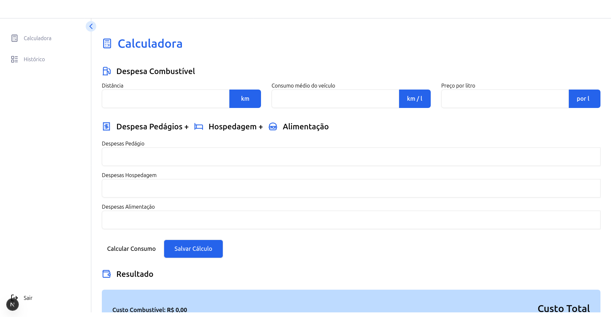

# Ray - Calculadora de Custos de Viagem

## Tecnologias Utilizadas

- **Frontend**: Next.js 15.4.6, TypeScript, Tailwind CSS
- **Backend**: Next.js API Routes
- **Banco de Dados**: PostgreSQL
- **Autenticação**: NextAuth.js

## Páginas Frontend

| Rota | Descrição | Status |
|------|-----------|--------|
| `/register` | Cadastro de novos usuários | ✅ |
| `/login` | Autenticação de usuários | ✅ |
| `/calculator` | Calculadora principal | ✅ |
| `/history` | Histórico de cálculos | ✅ |

## API Routes (Backend)

### Autenticação
- `POST /api/auth/register` - Cadastro de usuário
- `POST /api/auth/login` - Login de usuário

### Funcionalidades
- `POST /api/calculate` - Processar cálculo de viagem
- `POST /api/history` - Salvar histórico
- `GET /api/history` - Recuperar histórico do usuário

## Banco de Dados

**PostgreSQL** - Banco relacional

## 👥 Autores

- **Lucas Vieira** - *Desenvolvedor* - [@lucasarieiv](https://github.com/lucasarieiv)